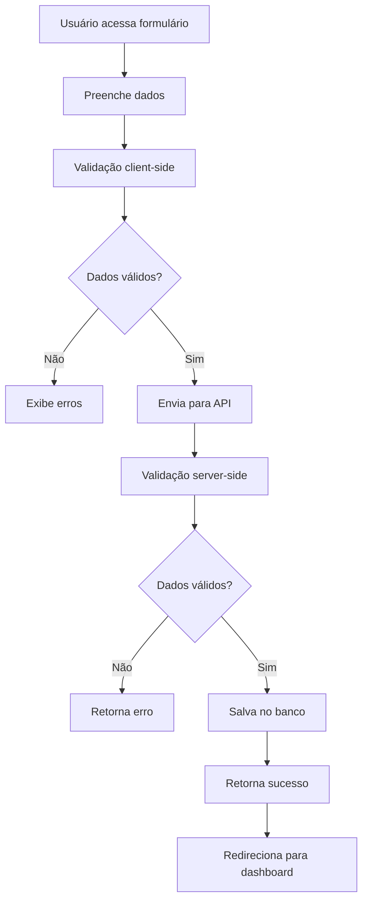

# Recursos do Sistema

## 📊 Visão Geral

O Sistema de Gestão Financeira Pessoal oferece um conjunto completo de funcionalidades para controle e análise de finanças pessoais, desenvolvido com foco na usabilidade e eficiência.

## 💰 Gestão de Receitas

### ✅ Funcionalidades Implementadas

#### Cadastro de Receitas
- **Descrição**: Campo obrigatório para identificação da receita
- **Valor**: Valor monetário com validação de formato
- **Data**: Seleção de data da transação
- **Tags**: Associação com múltiplas categorias
- **Validações**: Campos obrigatórios e formatos corretos

#### Listagem de Receitas
- **Visualização**: Lista todas as receitas cadastradas
- **Formatação**: Valores em formato monetário brasileiro (R$)
- **Datas**: Formato brasileiro (DD/MM/AAAA)
- **Tags**: Exibição das categorias associadas
- **Ordenação**: Por data (mais recentes primeiro)

#### Recursos Técnicos
- **API Endpoint**: `GET/POST /api/receitas`
- **Validação**: Server-side e client-side
- **Persistência**: PostgreSQL via Prisma ORM
- **Mapeamento**: Domain ↔ Database via mappers

### 🔄 Fluxo de Cadastro



## 💸 Gestão de Despesas

### ✅ Funcionalidades Implementadas

#### Cadastro de Despesas
- **Descrição**: Campo obrigatório para identificação da despesa
- **Valor**: Valor monetário com validação de formato
- **Data**: Seleção de data da transação
- **Tags**: Associação com múltiplas categorias
- **Validações**: Campos obrigatórios e formatos corretos

#### Listagem de Despesas
- **Visualização**: Lista todas as despesas cadastradas
- **Formatação**: Valores em formato monetário brasileiro (R$)
- **Datas**: Formato brasileiro (DD/MM/AAAA)
- **Tags**: Exibição das categorias associadas
- **Ordenação**: Por data (mais recentes primeiro)

#### Recursos Técnicos
- **API Endpoint**: `GET/POST /api/despesas`
- **Validação**: Server-side e client-side
- **Persistência**: PostgreSQL via Prisma ORM
- **Mapeamento**: Domain ↔ Database via mappers

## 🏷️ Sistema de Tags

### ✅ Funcionalidades Implementadas

#### Gestão de Tags
- **Criação**: Cadastro de novas categorias
- **Nome**: Identificação única da tag
- **Cor**: Seleção de cores predefinidas para identificação visual
- **Validação**: Nomes únicos e cores válidas

#### Tags Padrão (Seed)
- 🍽️ **Alimentação** (#ff5722)
- 🚗 **Transporte** (#2196f3)
- 🏠 **Moradia** (#4caf50)
- 🏥 **Saúde** (#f44336)
- 📚 **Educação** (#9c27b0)
- 🎮 **Lazer** (#ff9800)
- 💼 **Trabalho** (#607d8b)
- 📈 **Investimentos** (#795548)
- 🛒 **Compras** (#e91e63)
- 📄 **Contas** (#673ab7)

#### Associação com Transações
- **Múltiplas Tags**: Uma transação pode ter várias tags
- **Filtros**: Busca por categoria
- **Relatórios**: Agrupamento por tags

### 🎨 Interface Visual
- **Chips coloridos**: Identificação visual das tags
- **Seleção múltipla**: Interface intuitiva para associação
- **Cores consistentes**: Padronização visual em todo sistema

## 📈 Relatórios Financeiros

### ✅ Resumo Financeiro

#### Métricas Calculadas
- **Total de Receitas**: Soma de todas as receitas no período
- **Total de Despesas**: Soma de todas as despesas no período
- **Saldo**: Diferença entre receitas e despesas
- **Média de Receitas**: Receita média por transação
- **Média de Despesas**: Despesa média por transação

#### Filtros Disponíveis
- **Por Período**: Data início e data fim
- **Validação**: Datas válidas e período coerente
- **Formato**: YYYY-MM-DD (ISO 8601)

#### Recursos Técnicos
- **API Endpoint**: `GET /api/resumo`
- **Parâmetros**: `dataInicio` e `dataFim`
- **Cálculos**: Realizados no backend
- **Performance**: Queries otimizadas

### 📊 Visualização de Dados
- **Cards informativos**: Métricas principais em destaque
- **Cores semânticas**: Verde para positivo, vermelho para negativo
- **Formatação monetária**: Padrão brasileiro (R$ 1.234,56)
- **Responsividade**: Adaptação para diferentes telas

## 🖥️ Interface do Usuário

### ✅ Dashboard Principal

#### Componentes
- **Resumo Financeiro**: Cards com métricas principais
- **Navegação Rápida**: Botões para ações principais
- **Design Responsivo**: Adaptação mobile-first
- **Loading States**: Indicadores de carregamento

#### Ações Disponíveis
- **Adicionar Receita**: Acesso direto ao formulário
- **Adicionar Despesa**: Acesso direto ao formulário
- **Ver Transações**: Lista completa de movimentações
- **Gerenciar Tags**: Administração de categorias

### 🎨 Design System

#### Material-UI Components
- **Cards**: Containers para informações
- **Buttons**: Ações primárias e secundárias
- **Forms**: Campos de entrada padronizados
- **Typography**: Hierarquia tipográfica consistente

#### Tema Personalizado
- **Cores Primárias**: Azul (#1976d2)
- **Cores Secundárias**: Cinza (#757575)
- **Cores de Status**: Verde (sucesso), Vermelho (erro)
- **Tipografia**: Roboto (padrão Material-UI)

### 📱 Responsividade
- **Mobile First**: Design otimizado para dispositivos móveis
- **Breakpoints**: sm, md, lg, xl
- **Grid System**: Layout flexível e adaptável
- **Touch Friendly**: Elementos adequados para toque

## 🔧 Recursos Técnicos

### ✅ API RESTful

#### Endpoints Implementados

| Método | Endpoint | Descrição |
|--------|----------|----------|
| GET | `/api/receitas` | Lista receitas |
| POST | `/api/receitas` | Cria receita |
| GET | `/api/despesas` | Lista despesas |
| POST | `/api/despesas` | Cria despesa |
| GET | `/api/tags` | Lista tags |
| POST | `/api/tags` | Cria tag |
| GET | `/api/resumo` | Gera resumo financeiro |

#### Padrões de Resposta

**Sucesso (200/201)**
```json
{
  "success": true,
  "data": { ... },
  "message": "Operação realizada com sucesso"
}
```

**Erro (400/500)**
```json
{
  "success": false,
  "error": "Mensagem de erro",
  "details": { ... }
}
```

### 🗄️ Banco de Dados

#### Schema Prisma
- **Receita**: id, descricao, valor, data, createdAt, updatedAt
- **Despesa**: id, descricao, valor, data, createdAt, updatedAt
- **Tag**: id, nome, cor, createdAt, updatedAt
- **Relacionamentos**: Many-to-Many entre transações e tags

#### Recursos do PostgreSQL
- **UUID**: Identificadores únicos
- **Timestamps**: Controle de criação/atualização
- **Indexes**: Otimização de consultas
- **Constraints**: Integridade referencial

### 🐳 Containerização

#### Docker Compose
- **App**: Aplicação Next.js
- **Database**: PostgreSQL 15
- **Adminer**: Interface web para banco
- **Networks**: Comunicação entre containers
- **Volumes**: Persistência de dados

#### Configurações
- **Multi-stage build**: Otimização de imagem
- **Health checks**: Monitoramento de saúde
- **Environment variables**: Configuração flexível
- **Port mapping**: Exposição de serviços

## 🧪 Qualidade e Testes

### ✅ Estratégia de Testes

#### Configuração Jest
- **Test Environment**: jsdom para componentes React
- **Coverage**: Relatórios de cobertura
- **Mocks**: Simulação de dependências
- **Setup**: Configuração global de testes

#### Tipos de Teste Planejados
- **Unit Tests**: Entidades, Value Objects, Use Cases
- **Integration Tests**: Repositories, API Routes
- **Component Tests**: Componentes React
- **E2E Tests**: Fluxos completos de usuário

### 🔍 Linting e Formatação

#### ESLint
- **TypeScript**: Regras específicas para TS
- **React**: Regras para componentes React
- **Next.js**: Regras específicas do framework
- **Custom Rules**: Regras personalizadas do projeto

#### Prettier (Planejado)
- **Formatação automática**: Código consistente
- **Integração IDE**: Formatação ao salvar
- **Pre-commit hooks**: Validação antes do commit

## 🚀 Performance

### ✅ Otimizações Implementadas

#### Next.js
- **Static Generation**: Páginas estáticas quando possível
- **Image Optimization**: Otimização automática de imagens
- **Code Splitting**: Divisão automática de código
- **Bundle Analysis**: Análise de tamanho do bundle

#### Database
- **Connection Pooling**: Pool de conexões Prisma
- **Query Optimization**: Queries otimizadas
- **Indexes**: Índices em campos frequentemente consultados
- **Pagination**: Paginação para grandes datasets

### 📊 Métricas de Performance
- **Core Web Vitals**: Métricas de experiência do usuário
- **Bundle Size**: Tamanho otimizado do JavaScript
- **Database Queries**: Tempo de resposta das consultas
- **API Response Time**: Tempo de resposta das APIs

## 🔒 Segurança

### ✅ Medidas Implementadas

#### Validação de Dados
- **Input Sanitization**: Limpeza de dados de entrada
- **Type Validation**: Validação de tipos TypeScript
- **Business Rules**: Validação de regras de negócio
- **SQL Injection Prevention**: Proteção via Prisma ORM

#### Headers de Segurança
- **X-Frame-Options**: Proteção contra clickjacking
- **X-Content-Type-Options**: Prevenção de MIME sniffing
- **Referrer-Policy**: Controle de referrer
- **Content Security Policy**: (Planejado)

### 🔐 Autenticação (Planejado)
- **NextAuth.js**: Sistema de autenticação
- **JWT Tokens**: Tokens seguros
- **Session Management**: Gerenciamento de sessões
- **Role-based Access**: Controle de acesso por perfil

## 📋 Roadmap de Funcionalidades

### 🔄 Próximas Implementações

#### Curto Prazo (1-2 meses)
- [ ] **Edição de Transações**: Modificar receitas/despesas existentes
- [ ] **Exclusão de Transações**: Remover transações
- [ ] **Filtros Avançados**: Busca por descrição, valor, período
- [ ] **Paginação**: Lista paginada de transações
- [ ] **Ordenação**: Múltiplos critérios de ordenação

#### Médio Prazo (3-6 meses)
- [ ] **Gráficos e Charts**: Visualização gráfica dos dados
- [ ] **Exportação**: PDF, Excel, CSV
- [ ] **Importação**: Upload de arquivos CSV/Excel
- [ ] **Metas Financeiras**: Definição e acompanhamento
- [ ] **Notificações**: Alertas e lembretes

#### Longo Prazo (6+ meses)
- [ ] **Multi-usuário**: Sistema de usuários
- [ ] **Sincronização**: Backup e sincronização na nuvem
- [ ] **API Pública**: Integração com outros sistemas
- [ ] **Mobile App**: Aplicativo nativo
- [ ] **Inteligência Artificial**: Categorização automática

### 🎯 Melhorias Técnicas

#### Performance
- [ ] **Caching**: Redis para cache de dados
- [ ] **CDN**: Distribuição de conteúdo
- [ ] **Database Optimization**: Otimização avançada
- [ ] **Monitoring**: Monitoramento de performance

#### Qualidade
- [ ] **Test Coverage**: 90%+ de cobertura
- [ ] **E2E Tests**: Testes end-to-end completos
- [ ] **CI/CD**: Pipeline de integração contínua
- [ ] **Code Quality**: SonarQube ou similar

---

**O sistema está em constante evolução, com foco na experiência do usuário e qualidade técnica.**